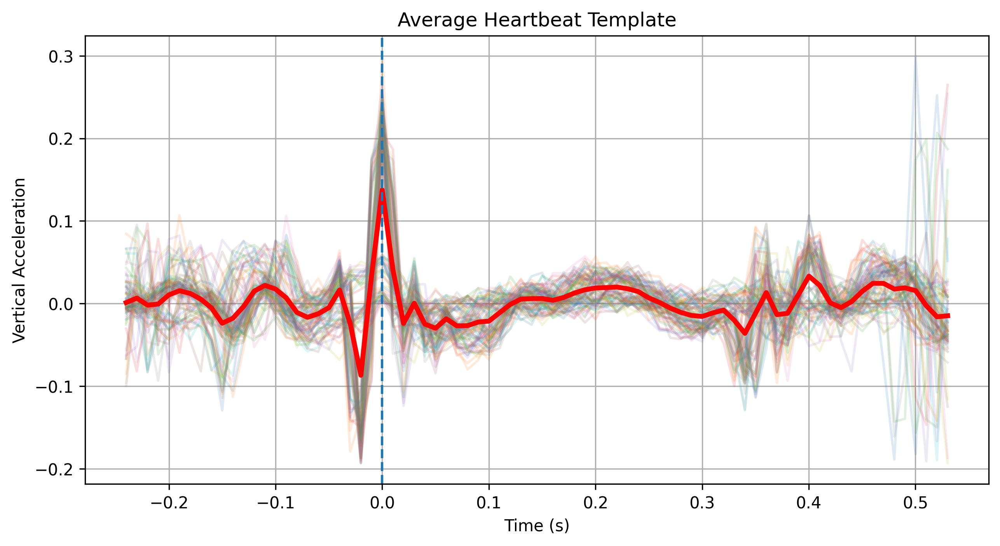

# seismokardiogram-signal-processing
Processing of seismokardiogram signals from a smartphone - test of using AI tools to accelerate data processing for physics experiments

- WHAT: smartphone is placed on the chest and the resulting acceleration/motion due to the  heartbeat (and breathing and random motions) is measured by the accelerometer and Phyphox app. 
- INPUT: data from smartphone accelerometer (excel file, body + gravitational acceleration)
- OUTPUT: estimated heartbeat rate and amplitude of chest wall motion

Pseudocode:
1. load excel data
2. cut of starting 3 seconds, apply high pass filter
3. output signal FFT (used to determine filter cutoff frequencies)
4. align all heartbeat signals to calculate the average/template signal
5. plot template + individual signals to asses variablility
6. integrate acceleration to obtain chest wall displacement due to a heartbeat, output values

NOTE:
1. code generated by ChatGPT as a test of its suitability for aiding data processing for school experiments
2. this approach filters and averages out too much of the signal, leading to an underestimate of the chest wall motion. If double integration is done on the raw (or only high-pass filtered) signal only, the value is much closed to one found in the literature.
